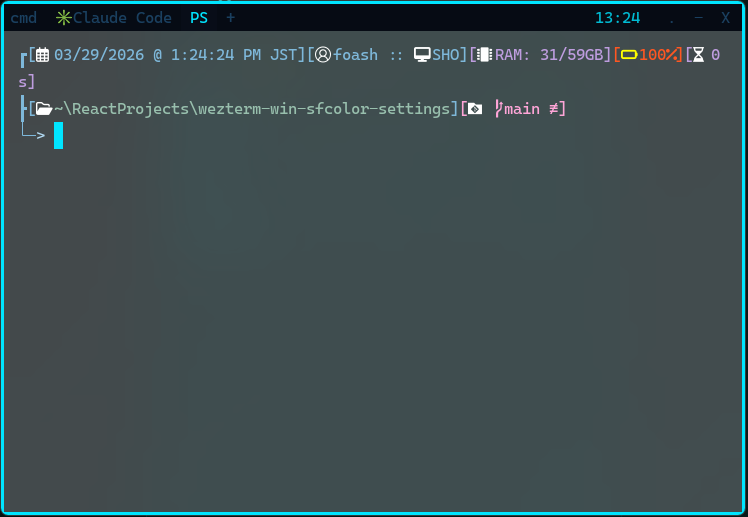

# Windowsでモテるターミナル

Windows向けのSF・サイバーパンク風WezTermテーマです。




---

## 特徴

- **カラーテーマ**: ダークネイビー背景 + サイバーシアン（`#00e5ff`）をアクセントカラーに使用
- **背景透過 + Acrylicブラー**: Windows 11のAcrylic APIを使い、背景を65%透過＋すりガラス風にぼかす
- **シアンの外枠ボーダー**: `window_frame` で3〜4pxのシアンラインをウィンドウ全体に縁取り
- **スマートなタブ表示**: タブタイトルをフルパスではなく末尾のフォルダ名やファイル名だけに短縮して表示
- **右上に時計**: ステータスバーに現在時刻をシアンで表示
- **統合ボタン**: `INTEGRATED_BUTTONS` でWezTermネイティブの×・最小化・最大化ボタンをタブバーに統合
- **Oh My Posh対応**: PowerShellプロンプトをOh My Poshでカスタマイズ済み

---

## 必要なもの

| ツール | 用途 |
|--------|------|
| [WezTerm](https://wezfurlong.org/wezterm/) | ターミナル本体 |
| [CaskaydiaCove Nerd Font](https://www.nerdfonts.com/font-downloads) | Powerline記号対応フォント |
| [Oh My Posh](https://ohmyposh.dev/) | PowerShellプロンプトのカスタマイズ |
| Windows 11 | Acrylicブラーの動作に必要 |

---

## セットアップ手順

### 1. WezTermのインストール

```powershell
winget install wez.wezterm
```

### 2. フォントのインストール

[Nerd Fonts GitHub](https://github.com/ryanoasis/nerd-fonts/releases/latest) から `CascadiaCode.zip` をDLして展開し、全 `.ttf` ファイルを右クリック →「すべてのユーザーに対してインストール」。

### 3. Oh My Poshのインストール

```powershell
winget install oh-my-posh
```

インストール後、プロファイルを開いて設定を追加：

```powershell
notepad $PROFILE
```

以下を貼り付けて保存（テーマは `Get-PoshThemes` で一覧確認できます）：

```powershell
oh-my-posh init pwsh --config "$env:POSH_THEMES_PATH\tokyo.omp.json" | Invoke-Expression
```

### 4. wezterm.lua の配置

以下のパスに `wezterm.lua` を配置します：

```
C:\Users\<username>\.config\wezterm\wezterm.lua
```

フォルダが存在しない場合は作成してください：

```powershell
New-Item -ItemType Directory -Path "$env:USERPROFILE\.config\wezterm" -Force
```

### 5. WezTermを再起動

設定は `automatically_reload_config = true` により自動で反映されますが、初回はWezTermを再起動してください。

---

## キーバインド

| キー | 動作 |
|------|------|
| `Ctrl+Shift+D` | ペインを左右に分割 |
| `Ctrl+Shift+E` | ペインを上下に分割 |
| `Alt+←` | 左のペインへ移動 |
| `Alt+→` | 右のペインへ移動 |
| `Alt+↑` | 上のペインへ移動 |
| `Alt+↓` | 下のペインへ移動 |

ペインとは１つのウィンドウの中に、
２つのセッションを作ることです。左でサーバーを動かし、右でAIAgentを動かす、みたいなこともできます

---

## カラーリファレンス

| 用途 | カラーコード |
|------|-------------|
| 背景 | `#020509` |
| メインテキスト | `#b0d8f0` |
| カーソル / アクセント | `#00e5ff` |
| サブシアン | `#00bcd4` |
| パープル | `#7c6fff` |
| 選択範囲 | `#003a5a` |
| ボーダー | `#00e5ff` |

---

## カスタマイズのヒント

**透過度の調整**（値が小さいほど透ける）:
```lua
config.window_background_opacity = 0.65  -- 0.5〜0.9で好みに調整
```

**ボーダーの太さ変更**:
```lua
border_left_width = '3px'   -- 1px〜5px程度
```

**Oh My Poshテーマの変更**:
```powershell
# 全テーマをプレビュー
Get-PoshThemes

# テーマ変更（$PROFILEを編集）
oh-my-posh init pwsh --config "$env:POSH_THEMES_PATH\<テーマ名>.omp.json" | Invoke-Expression
```

---